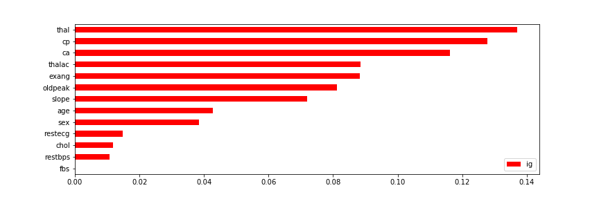
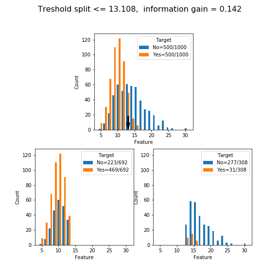
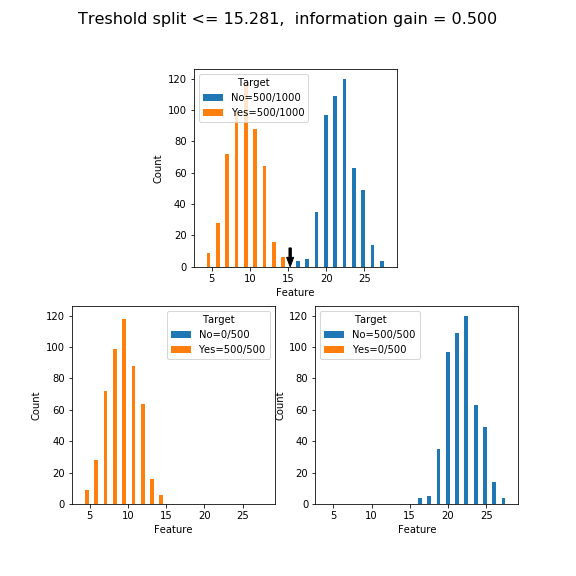

# EDA: visualize information gain via Gini Impurity

Function than can be to visualise categorical/continuous variables and rank them according to Information Gain for a split (i.e. as in the first step building a classification tree). See jupyter notebook included in repo for an example using a healthcare dataset.

Gini Impurity is calculated according to the formula


For continuous features all possible theresholds are evaluated and the max information gain is selected (defined as the gini impurity before the split minus the weighted gini impurity of the right and left node).

The function 

```
threshold,ig = gini_calc(data,y)

```
calculates the maximum information gain for a binary split for the feature 'data' and target 'y'. Supports multiple targets (i.e. three classes 0,1,2) but only binary splits.

The function 

```
plot_gini_hist(data,y,threshold,ig,'Target','Feature',{'0':'No', '1':'Yes'})

```
plots histograms before and after the split.

Computing information Gain for all features is a useful way to select the most important features for a classification problem without particular assumptions about the feature distribution. Importantly, the effects of feature correlations and outliers need to be taken into account. 



|:--:|
| Example of ranking of features in a Healthcare Dataset (see jupyter notebook for more details). In this formulation information gain is max at 0.5 |


## Examples on Random Data:

For an example on real data: visualize the interative notebook on [nbviewer here](https://nbviewer.jupyter.org/github/omadios/eda_information_gain/blob/main/Gini_Impurity_on_healthcare_tabular_data.ipynb)

```
length=500
s1 = np.random.normal(9, 2, length)
s2 = np.random.chisquare(10, length)+4
data =np.hstack([s1,s2])
y= np.hstack([np.ones(int(length)),np.zeros(int(length))])

threshold,ig = gini_calc(data,y)
plot_gini_hist(data,y,threshold,ig,'Target')

```


|:--:|
| Example visualization of two distributions which overlap|


```
length=500
s1 = np.random.normal(9, 2, length)
s2 = np.random.normal(22, 2, length)
data =np.hstack([s1,s2])
y= np.hstack([np.ones(int(length)),np.zeros(int(length))])

threshold,ig = gini_calc(data,y)
plot_gini_hist(data,y,threshold,ig,'Target')

```



|:--:|
| When distributions do not overlap there exist a split for which Gini Impurity is max i.e. 0.5 |


